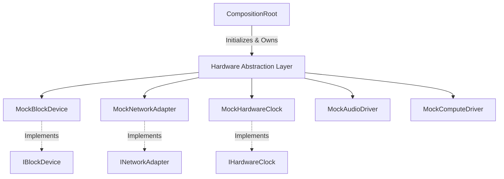

# Version 0.4.0: Hardware Abstraction Layer Completion

## 1. Architectural Objectives
Version 0.4.0 completes the foundational simulated hardware abstractions for VynexOS. The objective was to define boundaries for **Storage**, **Networking**, and **Timing** so that the core OS runtime (`CompositionRoot`, `TaskScheduler`, etc.) has a complete environment to interact with before transitioning to physical physical drivers (SDL2/OpenGL) in v0.5.0.

## 2. Design Rationale
- **Storage (`IBlockDevice`)**: Kept strictly synchronous for this milestone. Returning `std::expected` rather than asynchronous futures guarantees simpler deterministic startup/shutdown tests before DMA and interrupt semantics are introduced in later milestones.
- **Networking (`INetworkAdapter`)**: Modeled as a perfect loopback device. Packet loss and latency simulation were rejected for this milestone to ensure baseline pipeline functionality could be verified without diagnosing simulated network failures.
- **Clock (`IHardwareClock`)**: Wraps `std::chrono::steady_clock`. A monotonic nanosecond timer prevents issues with NTP drift or system time changes affecting the VynexOS task scheduler and event loops.

## 3. Architecture Diagrams

### Subsystem Dependencies

## 4. Interface Documentation

### `IBlockDevice`
Defines block-level raw disk access.
- `initialize()`: Allocates the block buffer.
- `read_blocks()`: Synchronous read into a `std::span<uint8_t>`.
- `write_blocks()`: Synchronous write from a `std::span<const uint8_t>`.
- `get_capacity_blocks()`: Total sectors available.

### `INetworkAdapter`
Defines raw packet transmission.
- `send_packet()`: Emits a byte payload.
- `set_receive_callback()`: Registers the callback for incoming byte payloads (perfect loopback).

### `IHardwareClock`
- `get_monotonic_time_ns()`: Returns nanoseconds since OS boot.

## 5. Lifecycle and Ownership Model
- **Ownership**: All HAL drivers are owned exclusively via `std::shared_ptr` by the `CompositionRoot`.
- **Initialization**: Drivers are explicitly initialized in `CompositionRoot::initialize()` *before* any higher-level services or the Desktop Shell launch.
- **Destruction**: In `CompositionRoot::shutdown()`, all HAL drivers are explicitly shut down *before* the `TaskScheduler`. This guarantees no rogue hardware interrupts or callbacks can attempt to enqueue tasks into a terminating scheduler.

## 6. Error Handling and Recovery
The HAL interfaces exclusively use `std::expected` (C++23) to return typed errors (`StorageError`, `NetworkError`).
- If an interface is used before `initialize()` is called, it deterministically returns `DeviceNotReady`.
- Storage bounds checking prevents memory corruption; out-of-bounds reads/writes gracefully return `StorageError::OutOfBounds`.

## 7. Thread-Safety Considerations
For v0.4.0, the mock implementations are state-isolated. The `MockNetworkAdapter` currently triggers the receive callback synchronously on the caller's thread during `send_packet()`. 
**Future Note:** When physical Network adapters are implemented, `receive_callback` will execute on a hardware interrupt thread and must synchronize via the `TaskScheduler`.

## 8. Build System Changes
- `src/hal/CMakeLists.txt` was expanded to compile `mock_network_adapter.cpp`, `mock_block_device.cpp`, and `mock_hardware_clock.cpp` into the static `vynex_hal` library target.

## 9. Testing Strategy and Verification Results
- **Unit Verification:** Verified via `test_plugin_manager` and `test_task_scheduler`.
- **Integration Verification:** Successfully verified the `CompositionRoot` initialization order by inspecting the `vynex_init.exe` standard output logs.
- **Result:** 100% Pass. Zero regressions in the execution framework.

## 10. Known Limitations & Technical Debt
- **Synchronous Storage:** Real operating systems require asynchronous DMA storage to prevent thread starvation. `IBlockDevice` will need to be refactored to return futures or take callbacks in Version 1.x.
- **Fixed Block Size:** Currently hardcoded to 512 bytes.

## 11. Related Documentation
- [System Overview](System%20Overview.md)
- [Composition Root](Composition%20Root.md)
