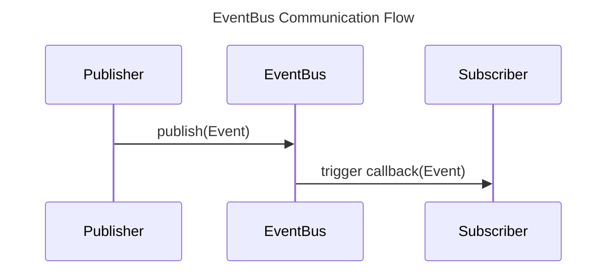

<!-- AUTO-GENERATED START -->
# Event Bus

## Event Bus

<!-- AUTO-GENERATED END -->

## Purpose & Design Goals
The Event Bus provides a decentralized pub-sub communication layer for loosely-coupled components across VynexOS. By type-erasing the payloads using `std::any`, it allows completely unrelated subsystems (e.g., the Window Manager and the HAL Input Driver) to communicate without compile-time dependencies on each other's domain objects.

## Internal Implementation Overview
Events are represented by a `vynexos::core::Event` structure, containing a `std::string` topic and a `std::any` payload. Consumers register an `EventHandler` (a `std::function`) against a specific string topic via the `subscribe()` method. When `publish()` is invoked, the underlying implementation (like `[[InMemoryEventBus]]`) dispatches the event payload to all registered callbacks.

## Ownership & Lifetime Management
Events are published via `std::shared_ptr<const Event>`. This ensures zero-copy semantics when an event is broadcast to multiple subscribers. The event payload lives as long as the slowest subscriber needs it, and is automatically cleaned up when the last `shared_ptr` goes out of scope. 
Subscribers must ensure that any objects referenced within their `EventHandler` closures outlive the subscription, or use weak pointers to detect destruction.

## Thread Safety & Execution Context
The `[[IEventBus]]` contract mandates strict thread-safety:
- **Thread Safety:** `publish()` and `subscribe()` are fully thread-safe and non-blocking. Multiple threads can publish concurrently.
- **Event Ordering:** The bus does *not* guarantee global chronological ordering of events, nor does it guarantee ordering for events published from the same thread.
- **Handler Concurrency:** Handlers for the *same* event instance execute sequentially in a single worker context, but handlers for *different* event instances execute concurrently on the underlying thread pool (typically driven by the `TaskScheduler`).

## Failure Handling & Error Recovery
Because payloads are passed as `std::any`, consumers must perform a safe `std::any_cast` (often checking `.type()` first). If an incorrect cast occurs, a `std::bad_any_cast` exception will be thrown. Delivery is guaranteed "at-most-once"; if the system shuts down before an asynchronous event is processed, it may be dropped entirely.

## Testing Strategy
Components relying on the Event Bus can be easily unit-tested by injecting a mock `[[IEventBus]]` to verify that the correct events are published, or by programmatically publishing events to trigger the component's handlers in isolation.

## Extension Points & Future Roadmap
- **Inter-Process Communication (IPC):** While currently memory-bound within a single process, the Event Bus design is intended to eventually bridge with the `[[LocalIpcFramework]]` to transparently route topics between different VynexOS processes.
- **Topic Wildcards:** Future updates may introduce wildcard subscription support (e.g., `HAL_INPUT_*`) for broader auditing or logging components.
