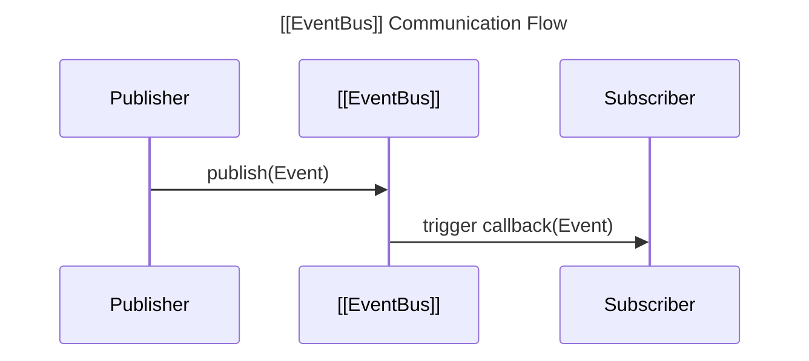

<!-- AUTO-GENERATED START -->
# Event Bus

## Event Bus

```mermaid
sequenceDiagram title [[EventBus]] Communication Flow
    participant P as Publisher
    participant EB as [[EventBus]]
    participant S as Subscriber
    P->>EB: publish(Event)
    EB->>S: trigger callback(Event)
```
<!-- AUTO-GENERATED END -->
