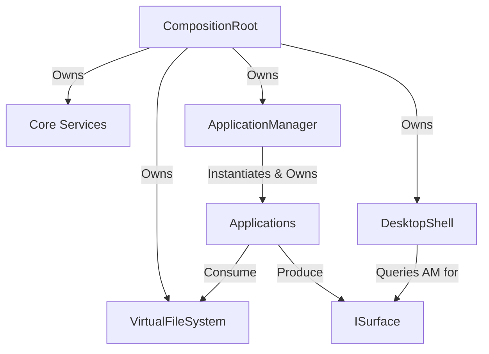

# VynexOS Version 0.7.0
## Technical Design Specification & Architecture Review
**Phase 1: Virtual File System & Application Framework**

---

## 1. Executive Summary
Version 0.7.0 initiates the transition of VynexOS from a static UI demonstrator into an interactive operating system platform. This architecture review formally defines the boundaries for the **Virtual File System (VFS)** and the **Application Framework**. By intentionally decoupling these subsystems from physical storage (`IBlockDevice`) and complex IPC process isolation, we prioritize interface stability, SOLID compliance, and technical debt resolution (TD-0002) without risking architectural collapse.

---

## 2. Architecture Review & Answers to Open Questions

### SECTION 1: Virtual File System Architecture

#### Q1: RAM-backed vs IBlockDevice?
- **Recommendation:** Implement strictly as an in-memory RAM-backed filesystem for v0.7.0.
- **Justification:** Coupling the initial VFS to physical storage abstractions (`IBlockDevice`) violates layer separation and introduces premature complexity (sector translation, caching, hardware latency). A VFS's core responsibility is namespace routing and node management. A `tmpfs`-style RAM-backed implementation forces the `IVirtualFileSystem` API to be cleanly decoupled. Storage abstractions will be integrated in v0.8.x behind the `IVNode` interface.

#### Q2: Synchronous vs Asynchronous API?
- **Recommendation:** The VFS must expose a strictly **Synchronous API** to callers.
- **Justification:** Filesystem operations (open, read, write) are fundamentally easier to consume if they act synchronously. Forcing state-machine driven asynchronous `EventBus` callbacks onto every read/write operation destroys API usability. For a RAM-backed VFS, operations are instantly synchronous. When physical disk latency is introduced later, the OS scheduler will block the calling thread or utilize a kernel async-worker pool, preserving the simple synchronous interface for the user-space application.

#### Q3: Required VFS Object Model
- **Introduce:** `VirtualPath`, `VNode` (Polymorphic base), `FileNode`, `DirectoryNode`, `FileHandle` (Stateful descriptor), `FileMetadata`.
- **Defer:** `DirectoryIterator` (Standard C++ vectors of `FileMetadata` suffice for v0.7.0 directory listings to minimize iterator invalidation risks).
- **Justification:** You cannot build a tree hierarchy without polymorphic nodes (`VNode`) and path resolution (`VirtualPath`). `FileHandle` is required to track read/write offsets independently of the underlying `VNode`.

#### Q4: MountPoint Support
- **Recommendation:** **Defer** `MountPoint` abstractions.
- **Justification:** v0.7.0 will utilize a single root `/` namespace. Future mount compatibility is guaranteed by the `VNode` abstraction; mounting simply involves injecting a delegated `VNode` (e.g., `Ext4RootNode`) into a specific `DirectoryNode`'s child map.

---

### SECTION 2: Application Framework

#### Q1: Application Process Isolation
- **Recommendation:** Desktop applications shall remain managed *within* the unified runtime process for v0.7.0, orchestrated by an `ApplicationManager`.
- **Justification:** Ejecting applications into independent background services communicating via `IIpcFramework` requires a functional Process Manager, MMU abstractions, and a hardened IPC protocol. This is excessive scope. We must first standardize the application boundary via the `IApplication` interface inside the unified process.

#### Q2: Application Lifecycle
- **Recommendation:** `Initialize() -> Start() -> Update() -> HandleEvent() -> Render() -> Shutdown()`.
- **Justification:** `Init/Run/Suspend/Terminate` implies a threaded, headless background service. Because these are interactive UI applications participating in the DesktopShell's composite render loop, they require explicit, frame-synchronized hooks for input consumption (`HandleEvent`) and surface drawing (`Render`).

#### Q3: Introduction of IApplicationManager
- **Recommendation:** **Introduce** `IApplicationManager`.
- **Justification:** `DesktopShell` currently handles both window compositing AND application instantiation. This violates the Single Responsibility Principle. `ApplicationManager` assumes ownership of discovery, lifecycle execution, and input routing, allowing `DesktopShell` to focus exclusively on `ISurface` Z-ordering and rendering.

---

## 3. Service Ownership Diagram
Ownership and lifetimes are managed via strict RAII down the dependency tree.

---

## 4. Layer and Dependency Direction
**Dependency Rule:** Outer layers depend on inner layers.
1. **Applications** (BasicFileExplorer)
2. **Application Framework** (`IApplication`, `IApplicationManager`)
3. **OS Services** (`IVirtualFileSystem`)
4. **Core Services** (`IEventBus`, `ILogger`)
5. **HAL** (`IInputDriver`)

**Verification:** The dependency direction is correct. Applications consume the VFS and the App Framework; they do not dictate core services.

---

## 5. Interface Recommendations
Only the following pure virtual interfaces shall be defined in Phase 1:
- `IVirtualFileSystem`: High-level POSIX-style API (Open, Read, Write, Stat).
- `IVNode`: Polymorphic internal representation of a file/directory.
- `IApplication`: The standard lifecycle boundary.
- `IApplicationManager`: The registry and execution engine for `IApplication`s.

---

## 6. Architecture Documentation
The following documents will be generated before implementation begins:
- `docs/architecture/v0.7.0_VFS_Architecture.md`
- `docs/architecture/v0.7.0_Application_Framework.md`
These documents will elaborate on the object models, trade-offs, and verification strategies defined in this specification.

---

## 7. Risk Assessment & Mitigation
- **Risk: Premature Storage Coupling:** Mitigation -> Strictly forbid `IBlockDevice` dependencies in `IVirtualFileSystem`.
- **Risk: Interface Instability (VFS):** Mitigation -> Align `IVirtualFileSystem` with established POSIX semantics (`open`, `read`, `write`, `close`) which are historically stable.
- **Risk: Thread Safety:** Mitigation -> The VFS shall utilize `std::shared_mutex` for concurrent reads and exclusive writes at the `VNode` level.

---

## 8. Verification Plan (Phase 1)
Implementation must not begin until the following pipeline is cleared:
1. **Architecture Review:** (This Document).
2. **Interface Review:** Draft `IVirtualFileSystem.hpp` and `IApplication.hpp` and pass static analysis.
3. **Dependency Analysis:** Verify no circular dependencies exist between `apps/`, `core/`, and `desktop/`.

---

## 9. Future Version Considerations (v0.8.0+)
- `IVNode` will be subclassed to `Ext2VNode` or `Fat32VNode` linked to an `IBlockDevice`.
- `IApplication` instances will be ejected into isolated address spaces managed by `IIpcFramework`.

---

## 10. Phase 1 Approval Decision
**RECOMMENDATION:** Approve the Architectural Design Specification for Version 0.7.0 Phase 1. The VFS and Application Manager scopes aggressively solve existing technical debt while maintaining safe, decoupled boundaries.
